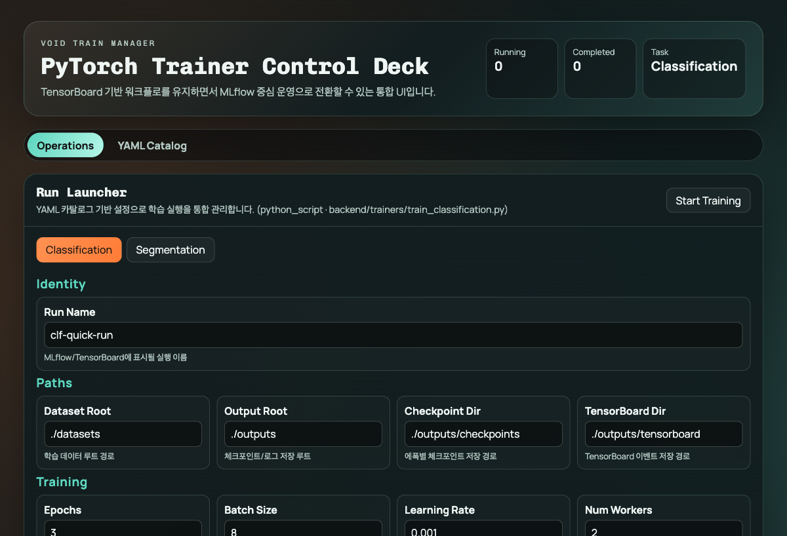

# Void Train Manager

PyTorch 학습(분류/세그)을 웹 UI로 실행하고 MLflow 중심으로 추적/선택/서빙까지 연결하는 로컬 MLOps 도구입니다.

학습 런처 UI/백엔드는 `backend/config/training_catalog.yaml` 하나로 일원화되어 동작합니다.

모델 배포는 UI의 `Model Serving` 섹션에서 `.pth/.pt`를 FTP 레지스트리에 등록하고,
선택적으로 PyTorch 표준 아티팩트(`model-standard.pt`)로 변환 등록할 수 있습니다.



## 최근 반영 사항

- `backend/config/training_catalog.yaml` 단일 파일로 다음을 일원화:
  - 분류/세그 학습 시작 방식(`python_script`/`python_module`)
  - CLI 인자 정의(필수/기본값/검증/설명/UI 라벨)
  - 웹 폼 렌더링 순서/그룹/도움말
  - 런타임 기본값(로그/체크포인트/MLflow 연동)
- UI `YAML Catalog` 탭에서 설정 파일을 조회/검증/저장 가능
- UI `YAML Studio` 탭에서 task/registry를 폼으로 편집하고 `extraFields`(JSON array)까지 관리 가능
- `Model Serving`에서 `.pth/.pt` 업로드 + 표준 아티팩트 변환 등록 지원
- `Model Serving`에서 웹 파일 업로드(`Upload + Register`)로 즉시 FTP 등록 지원
- `Model Serving`에서 MLflow 베스트 run 자동 선택 후 FTP 등록(`Pick Best + Publish`) 지원
- `Model Serving > Model Registry Browser`에서 모델별(`classification`/`segmentation`) stage/version 리스트 조회 및 다운로드 지원
- 클라이언트는 `Dataclass` 기반 설정 + 싱글톤 패턴으로 FTP 모델 다운로드 경로를 관리
- 학습/레지스트리 Stage를 `dev`/`release`로 분리 운영 가능

## 빠른 시작

1. 백엔드 + MLflow 실행

```bash
uv venv .venv --python 3.11
uv sync --python .venv/bin/python --only-group backend --no-default-groups
./backend/scripts/start_mlflow_local.sh
```

새 터미널:

```bash
./backend/scripts/start_api.sh
```

2. 프론트 실행

```bash
cd frontend
pnpm install
pnpm dev
```

3. 접속

- UI: `http://127.0.0.1:5173`
- API: `http://127.0.0.1:8008/api/health`
- MLflow: `http://127.0.0.1:5001`

## 의존성 관리

- 기본: `uv sync --python .venv/bin/python --only-group backend --no-default-groups`
- pip fallback: `.venv/bin/python -m pip install -r backend/requirements.txt`
- requirements 동기화: `./backend/scripts/sync_requirements.sh`

## 런처 설정 일원화

- 단일 설정 파일: `backend/config/training_catalog.yaml`
- 경로 오버라이드: `.env`의 `TRAINING_CATALOG_PATH`
- `.env` 예시: `.env.example`
- 변경 가능한 항목:
  - UI에 노출할 task 목록/이름/설명
  - task별 시작 방식(`python_script` 또는 `python_module`)과 실행 타깃
  - task별 field 순서/숨김/기본값/라벨/설명
  - task별 동적 CLI 인자(`extraFields`: 타입/필수 여부/기본값/choices/CLI flag)
  - MLflow best metric/mode/modelName/artifactPath 기본값

### 외부 `train.py` + YAML 인자 정의 예시

```yaml
tasks:
  - taskType: classification
    baseTaskType: classification
    runner:
      startMethod: python_script
      target: /abs/path/to/your/train_classification.py
    extraFields:
      - name: task_name
        valueType: str
        required: true
        default: classification
      - name: profile
        valueType: str
        type: select
        default: quick
        choices: [quick, full]
      - name: dry_run
        valueType: bool
        type: boolean
        default: false
```

- `extraFields`는 런처 UI 폼에 자동 노출되고, `runs/start` 시 CLI 인자로 직렬화되어 전달됩니다.
- 외부 스크립트가 내부 dataclass 기본 인자까지 받지 않는 경우 `hiddenFields`/`fieldOrder`와 함께 스크립트 인자 규약을 맞춰 사용하세요.
- 코드 수정 없이 `YAML Studio -> Advanced Fields`에서 `fieldOverrides`/`extraFields`를 편집해 반영할 수 있습니다.

## FTP 등록 방식 (신규)

- 자동: `Publish Best Run to FTP` 카드에서 MLflow 실험/metric 기준 베스트 run을 찾고 바로 FTP registry에 등록
- 수동: `Upload .pth/.pt and Register` 카드에서 파일 업로드 후 stage/version 지정 등록

## 문서

- [Setup](./docs/SETUP.md)
- [Architecture](./docs/ARCHITECTURE.md)
- [FTP Model Registry](./docs/FTP_MODEL_REGISTRY.md)
- [E2E Report](./docs/E2E-REPORT.md)
- [Web Usage Guide (with screenshots)](./docs/WEB_USAGE_GUIDE.md)
- [YAML Studio UX Analysis](./docs/UX_ANALYSIS_YAML_STUDIO.md)
- [YAML Studio Risk Analysis](./docs/RISK_ANALYSIS_YAML_STUDIO.md)
