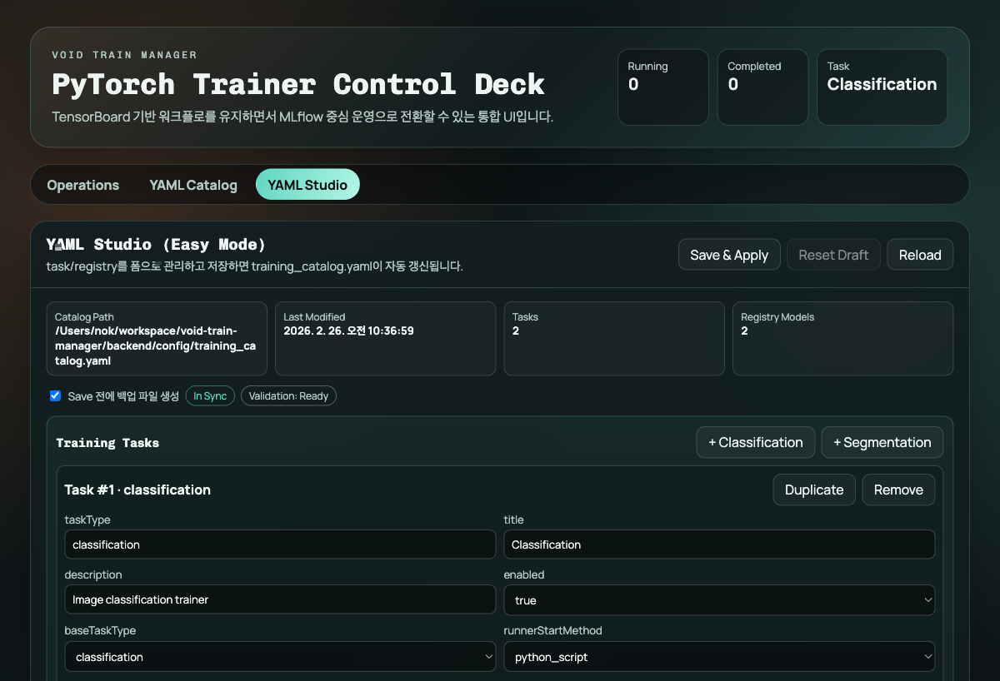
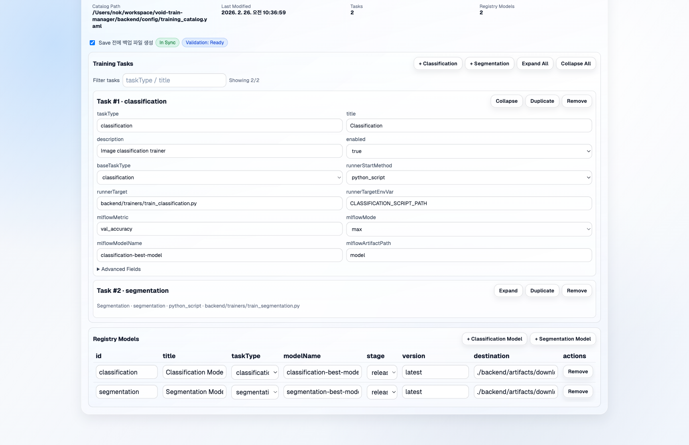
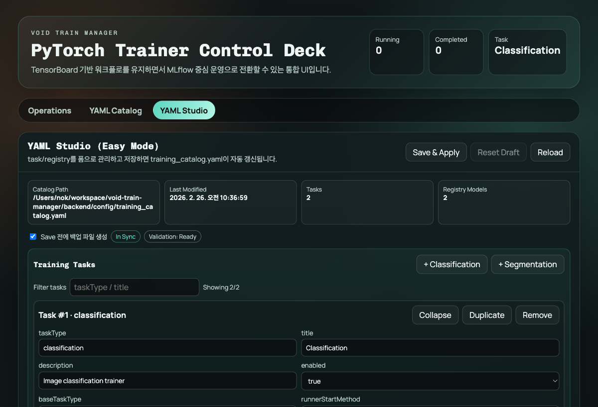
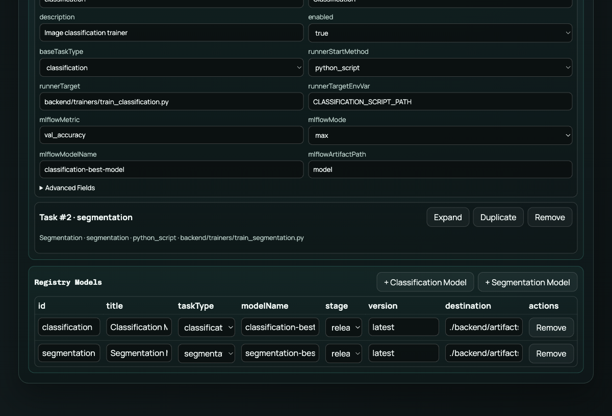

# YAML Studio UX Analysis (Before/After)

`YAML Studio` 전용 탭 추가 후 실제 화면 기준으로 UX를 점검하고, 1차/2차 개선을 반영한 기록입니다.

## Capture 기준

- 캡처 도구: Playwright CLI (`$PWCLI`)
- 화면: `http://127.0.0.1:5173/?tab=studio`

## Before

관찰 이슈:

1. task 카드가 모두 펼쳐져 있어 스크롤이 길고 집중 포인트가 분산됨
2. 특정 task를 빠르게 찾는 검색/필터가 없어 편집 시간이 길어짐
3. Registry 표의 핵심 컬럼(`modelName`, `destination`)이 좁아 값이 잘림

## 개선 내용

1. task 카드 `Expand/Collapse` + `Expand All/Collapse All` 추가
2. `Filter tasks` 입력으로 taskType/title/baseTaskType 빠른 필터 추가
3. Registry 표 컬럼 최소 너비 조정(`modelName`, `destination`)으로 가독성 개선

## 2차 개선 (E2E 기반)

1. `Collapse All` 정합성 수정

- 문제: 첫 번째 task가 기본 fallback으로 남아 완전히 접히지 않는 케이스 존재
- 개선: `Collapse All` 시 모든 task index를 명시적으로 `false` 설정

2. `fieldOverrides` 저장 UX 개선

- 문제: 사용자가 minified JSON을 입력해도 문자열 포맷 차이로 저장이 계속 막히는 오탐
- 개선: JSON semantic 비교로 mismatch 판정 변경 + blur 시 canonical pretty JSON으로 정규화

3. 탭 이동 보호 동선 재검증

- 미저장 상태에서 tab 이동 시 confirm 노출
- 취소 시 현재 탭 유지, 승인 시 이동 동작 확인

4. `extraFields` 고급 편집 동선 추가

- 배경: 외부 `train.py` 인자를 YAML에서 관리하려면 고급 JSON 편집이 필요
- 개선: `Advanced Fields`에 `extraFields (JSON array)` 편집 영역 추가
- 결과: `name/valueType/required/default/choices/cliArg`를 코드 수정 없이 UI에서 관리 가능

## After

개선 결과:

- 대량 task 편집 시 인지 부하 감소
- 원하는 task로 이동 시간이 단축
- Registry 핵심 값 확인성 개선
- `fieldOverrides` 편집 시 저장 가능 조건이 예측 가능해짐
- `extraFields` 편집도 동일한 저장 조건(파싱/반영 일치)으로 일관화됨
- 탭 이동 시 변경 유실 위험이 낮아짐

## 다음 리스크 점검 포인트

1. 저장 전 데이터 무결성(중복/필수값/JSON 파싱 오류) 방어 강화
2. 저장 후 스키마 반영 상태를 더 명확히 피드백
3. 실수로 탭 이동 시 미저장 변경 유실 방지 동선 강화
