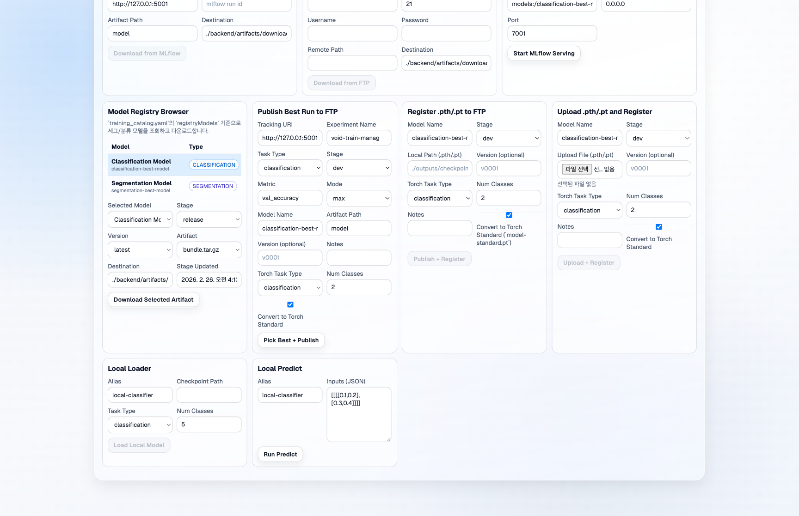
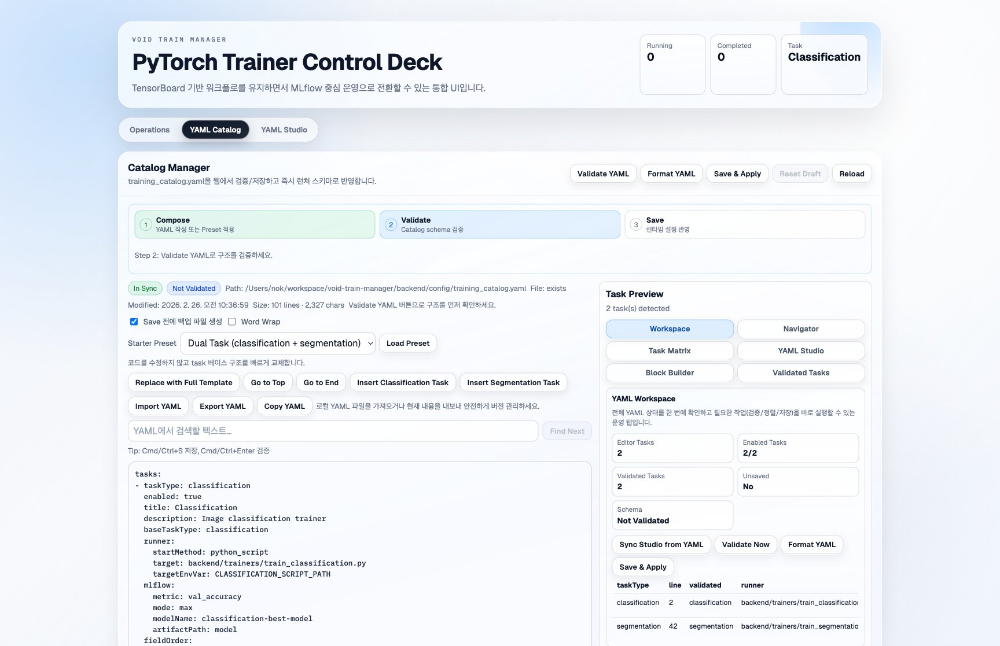

# Web Usage Guide

`Control Deck`에서 실제로 할 수 있는 작업만 정리한 가이드입니다.

## 1) Operations

- `Run Launcher`
  - task별 학습 실행
  - catalog 기반 동적 입력 필드로 파라미터 전달
- `Live Runs`
  - 진행률(`epoch/total_epochs`) 확인
  - 최근 로그 확인
  - 실행 중인 run 중지
- `MLflow Ops`
  - metric/mode 기준 best run 선택
  - 선택 run을 MLflow Model Registry에 등록
  - 최근 MLflow runs 확인

## 2) Model Serving

- `MLflow Serving`
  - model URI 기준 서빙 프로세스 시작/중지
  - 현재 활성 서버 목록 조회
- `Local Model Serving`
  - 로컬 체크포인트 로드
  - 입력 샘플로 추론 테스트

## 3) FTP Registry

- `Publish`
  - MLflow run artifact를 FTP registry로 publish
  - local `.pt/.pth` 업로드 후 registry 등록
  - best run 자동 선택 후 publish
- `Browse & Download`
  - model/stage/version/artifact 선택
  - 선택 artifact 로컬 다운로드

## 4) YAML Catalog

- `Validate YAML`
- `Format YAML`
- `Save & Apply`

위 3단계로 YAML 변경을 검증하고 PostgreSQL catalog revision에 즉시 반영할 수 있습니다.

## 5) YAML Studio (Easy Mode)

- task/registry 항목을 폼으로 편집
- `runnerTarget`, `mlflow*` 기본값, `fieldOverrides`, `extraFields` 편집
- 저장 시 catalog validation과 동기화

## 6) 외부 `train.py` / YAML 설정 도움말

`runner.target`, `startMethod`, `extraFields`, `fieldOrder` 설정 방법은 아래 문서 참고:

- [Train.py Path & YAML Help](./TRAIN_PY_YAML_HELP.md)
